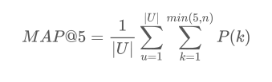

## Etude de la fonction de notation

[Retour au sommaire d'Expedia](expedia_sommaire.md)

### Introduction

Comme pour chaque challenge hébergé par kaggle, l'organisateur du challenge donne une fonction de notation prenant en paramètre les données soumises par le participant et les données réellement enregistrées. Cette fonction permet de produire le classement des participants. Il est donc utile d'étudier cette méthode de notation pour une meilleur approche du problème.

La page kaggle du challenge nous fournit une [première explication](https://www.kaggle.com/c/expedia-hotel-recommendations/details/evaluation) de cette fonction. Nous nous attelons ici la tâche de comprendre plus en profondeur cette fonction de notation.

### Données à soumettre

Pour se classer dans le challenge Expedia, on nous demande de soumettre un fichier au format `csv` associant les identifiants des utilisateurs (colonne `id`) à une liste de au plus cinq clusters d'hôtels (colonne `hotel_cluster`). Voir [l'explication des données](expedia_data.md#informations-sur-lhôtel) pour une explication de la donnée `hotel_cluster`.

Il s'agit donc de prédire quelles cluster sont susceptibles d'être cliqués par l'utilisateur pour lui proposer en suggestion. On peut faire jusqu'à cinq suggestions.

### Formule d'évaluation

Pour évaluer la pertinence des suggestions et conformément au format des challenge kaggle, les résultats prédis sont comparés à des résultats réels. Dans ce cas, Expedia utilise pour les résultats réel la suite de clics effectué par l'utilisateur.

En résumé les deux données comparées sont
* Les cinq suggestions de clic faites à partir des réservations de `test.csv`
* La suite des clic qui ont été enregistrés sur la base de données Expedia et qui ne sont pas fournis aux participants

Dans la page concernant l'évaluation, on nous propose une formule expliquant comment la notation est faite : 

Ainsi on effectue la moyenne sur l'ensemble de l'échantillon des utilisateurs de la somme des précisions `P(k)` de chaque suggestions faites.

On considère les cinq suggestions de cluster faites à un utilisateur et la suite clusters réellement cliqués par l'utilisateur.

**La précision P(k) vaut alors :**
* 0 si la k-ème suggestion faite ne fait pas partie des clusters cliqués
* k/i si la k-ème suggestion a le rang i dans la liste des clusters réellement cliqués.
